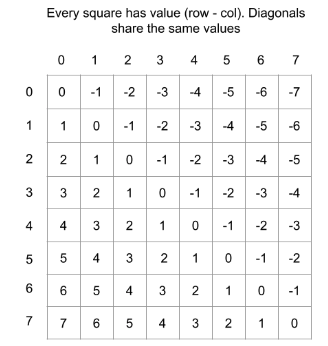
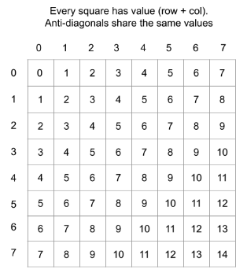

# Iterating through a Matrix
This section discusses the many ways you can iterate through a matrix.

## Iterating by Row or Column
```{code-block} python
---
linenos:
---
def iteration(board):
    // Iterating by Row
    m, n = len(board), len(board[0])
    for r in range(m):
        for c in range(n):
            print(board[r][c])
    
    // Iterating by column
    for c in range(n):
        for r in range(m):
            print(board[r][c])
```

## Iterating by (Anti)-Diagonal
### Diagonal


In the above diagram, all diagonals (left to right) share the same values as `(row - col)`
```{code-block} python
---
linenos:
---
def iteration(board):
    m, n = len(board), len(board[0])
    //Iterating through the main diagonal
    for r in range(m):
        for c in range(n):
            if r - c == 0:
                print(board[r][c])
    

def iteration(r, c, board):
    m, n = len(board), len(board[0])
    val = r - c
    //Iterating through the diagonal of (r, c)
    for row in range(m):
        for col in range(n):
            if row - col == val:
                print(board[row][col])
            
```

### Anti-Diagonal

In the above diagram, all anti-diagonals (right to left) share the same values as `(row + col)`
```{code-block} python
---
linenos:
---
def iteration(board):
    m, n = len(board), len(board[0])
    //Iterating through the main anti-diagonal
    for r in range(m):
        for c in range(n):
            if r - c == n:
                print(board[r][c])
    

def iteration(r, c, board):
    m, n = len(board), len(board[0])
    val = r + c
    //Iterating through the diagonal of (r, c)
    for row in range(m):
        for col in range(n):
            if row - col == val:
                print(board[row][col])
```

## Iterating through the border of a matrix
1. If you want to iterate through the border elements of a matrix:
```
def border(matrix):
    m, n = len(matrix), len(matrix)[0]
    elements = []
    for r in range(1, m - 1): # left and right sides of the border
        elements.append(matrix[r][0])
        elements.apepnd(matrix[r][n - 1])
    for c in range(n): #top and bottom border
        elements.append(matrix[0][c])
        elements.append(matrix[m - 1][c])
```
